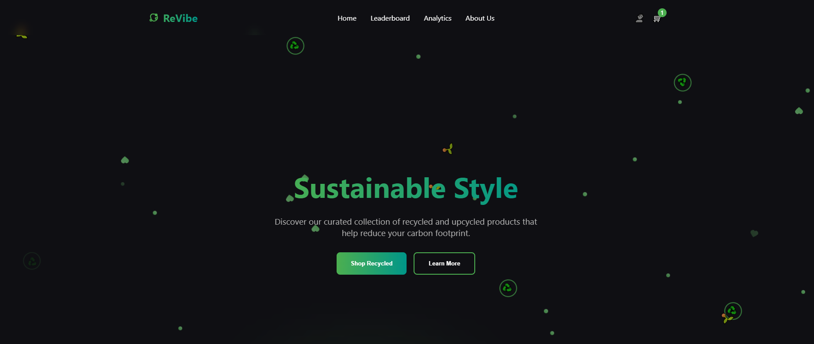
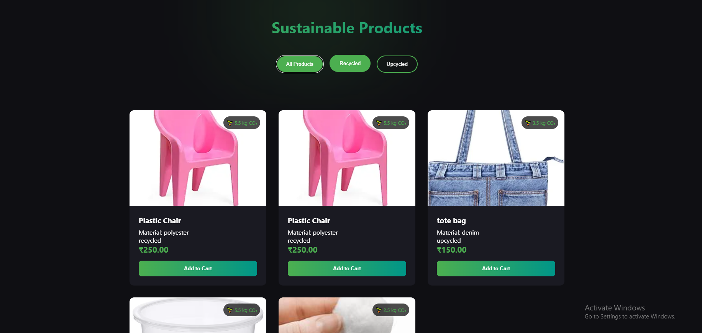
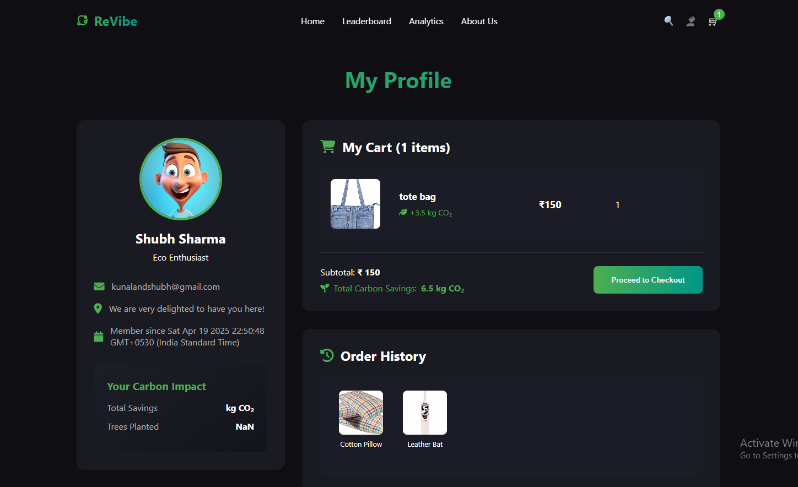
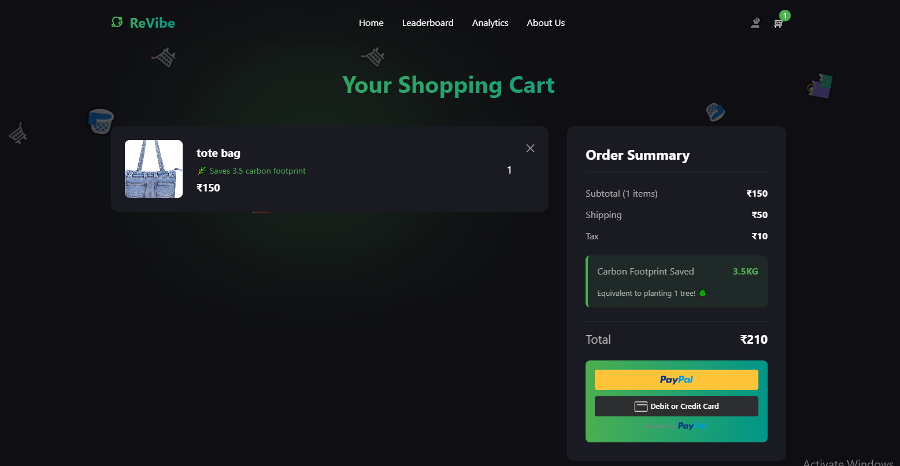
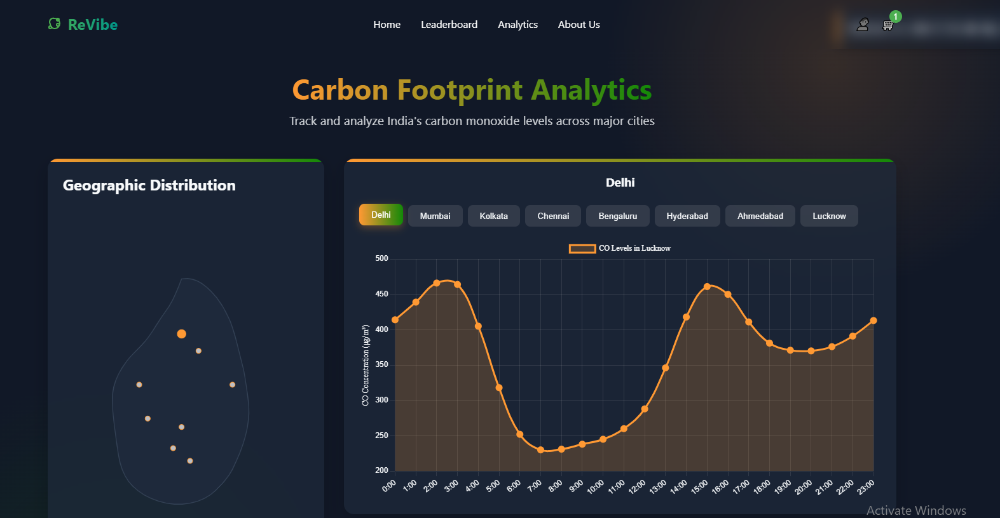
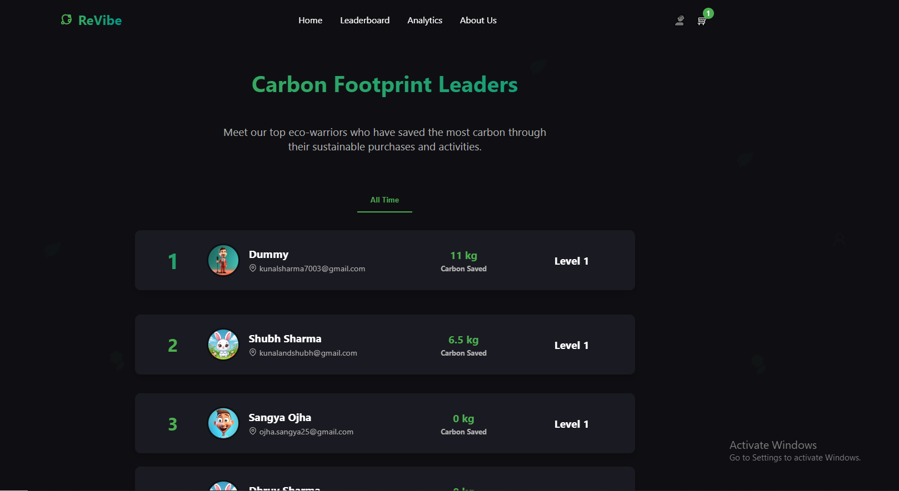
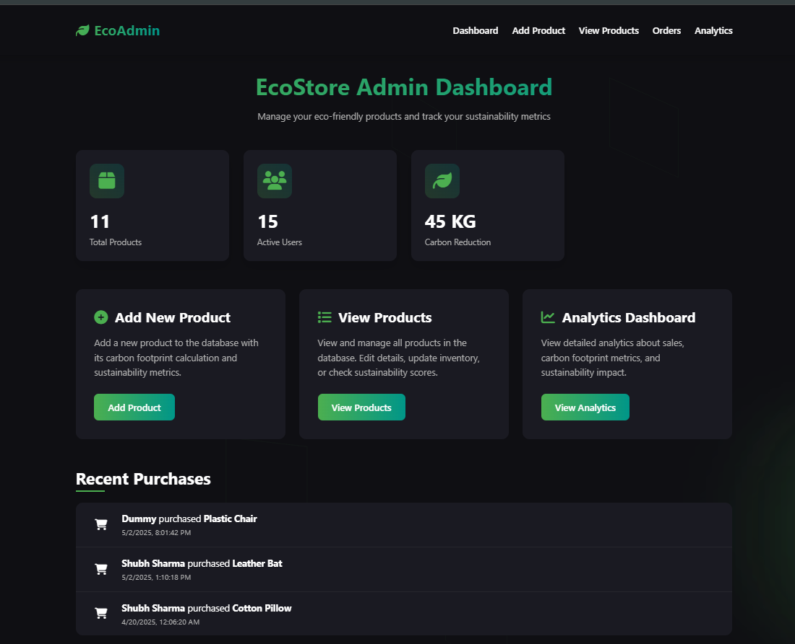
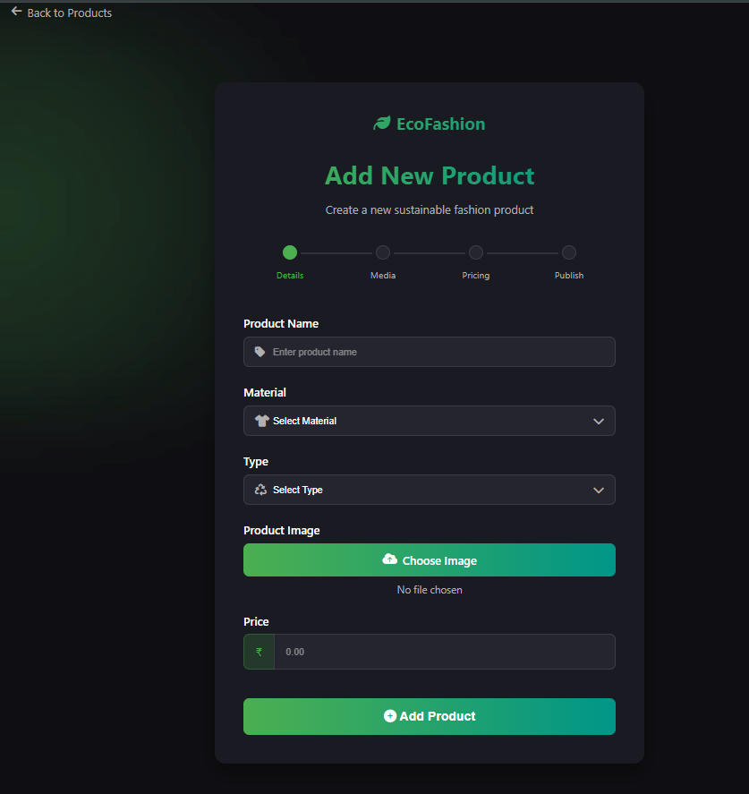

<h1 align="center">♻️ <em>Revibe - Sustainable E-commerce Platform</em> 🌍</h1>
<p align="center">
  🌐 <a href="https://re-vibe-coral.vercel.app/" target="_blank">Live Demo</a>
</p>

<div align="center">


<p align="center">
  
</p>

### 🌱 *Making Sustainable Shopping Accessible to Everyone* 🌱

*Revibe is an environmentally-conscious e-commerce platform developed for the WebDash hackathon. The platform exclusively lists recycled and upcycled products along with their carbon footprints, allowing environmentally conscious consumers to make informed purchasing decisions.*

<p align="center">
  
  
  
  
</p>

---


</div>

## 🌟 **About The Project**

Revibe is an environmentally-conscious e-commerce platform developed for the **WebDash hackathon**. The platform exclusively lists recycled and upcycled products along with their carbon footprints, allowing environmentally conscious consumers to make informed purchasing decisions.

---

## ✨ **Features**

<div align="center">


</div>

<table>
<tr>
<td width="50%">

### ♻️ **Product Listing**
Exclusively displays recycled or upcycled products with:
- Detailed carbon footprint information
- Materials used and environmental impact
- Sustainability metrics categorization
- Transparent environmental data

### 🛒 **Cart System**
Comprehensive shopping cart with:
- Add, remove, and manage products
- Adjust quantities with real-time subtotals
- Save items for later
- Accumulated carbon footprint display

### 💳 **Payment Gateway**
- Secure **PayPal integration**
- Protected transactions
- Multiple payment options
- Trusted checkout experience

### 📊 **Order Carbon Summary**
- Calculates total environmental impact
- Aggregates product carbon footprints
- Comprehensive purchase impact view
- Make adjustments based on data

</td>
<td width="50%">

### 🌍 **Global Footprint Tracker**
- Display total carbon footprint
- Based on purchase history
- Visualize environmental impact over time
- Set personal reduction goals

### 🔐 **User Login System**
- Secure OTP system via email
- No password security risks
- Admin account with enhanced security
- Session management

### 📱 **Mobile Responsive Design**
- Optimized for all screen sizes
- Seamless desktop and mobile experience
- Adaptive responsive design
- Consistent functionality across devices

### 🏆 **Green Leaderboard**
- Rank users by eco-friendly purchases
- Carbon footprint reduction tracking
- Gamification for sustainable habits
- Special badges and rewards

</td>
</tr>
</table>

### 🎯 **Additional Features**

<div align="center">

| Feature | Description | Status |
|---------|-------------|--------|
| 👨‍💼 **Admin Dashboard** | Manage products, categories, and sustainability data | ✅ Active |
| 🌐 **Live Carbon Data API** | Real-time carbon emission data integration | ✅ Active |
| 📊 **Sustainability Metrics** | Materials, manufacturing, transportation analysis | ✅ Active |
| 🎓 **Educational Content** | Information about sustainable consumption | ✅ Active |

</div>

---

<div align="center">

</div>

## 📸 **Screenshots**

<div align="center">

### 🏠 **Home & Product Listing**

| 🏠 **Homepage** | 🛍️ **Product Grid** |
|:---------------:|:-------------------:|
|  |  |
| *Landing page with featured products* | *Recycled & upcycled products* |

</div>

<div align="center">

### 🛒 **Shopping Experience**

| 📦 **Product Details** | 🛒 **Shopping Cart** |
|:----------------------:|:--------------------:|
|  |  |
| *Carbon footprint & sustainability info* | *Cart with environmental impact* |

</div>

<div align="center">

### 📊 **Environmental Tracking**

| 🌍 **Footprint Tracker** | 🏆 **Green Leaderboard** |
|:------------------------:|:------------------------:|
|  |  |
| *Personal carbon footprint history* | *Top eco-friendly shoppers* |

</div>

<div align="center">

### 👨‍💼 **Admin Panel**

| 📊 **Dashboard** | ➕ **Add Product** |
|:----------------:|:------------------:|
|  |  |
| *Analytics & management* | *Product creation interface* |

</div>

---

## 🧱 **Environmental Impact Features**

<div align="center">

### ♻️ **Carbon Footprint Calculation**

</div>

<table>
<tr>
<td width="33%">

#### 📦 **Individual Products**
- Materials used
- Manufacturing process
- Transportation impact
- End-of-life recyclability

</td>
<td width="33%">

#### 🛍️ **Complete Orders**
- Aggregate product footprints
- Total order impact
- Comparative analysis
- Sustainability score

</td>
<td width="33%">

#### 👤 **User History**
- Overall shopping impact
- Historical trends
- Progress tracking
- Reduction goals

</td>
</tr>
</table>

### 📊 **Sustainability Metrics**

Products are evaluated based on:
- 🌿 **Materials used** (percentage of recycled content)
- ⚡ **Manufacturing process** energy consumption
- 🚚 **Transportation** distance and method
- ♻️ **End-of-life** recyclability and biodegradability

### 👥 **User Engagement**

<div align="center">

| Feature | Description |
|---------|-------------|
| 🏆 **Green Leaderboard** | Encourage eco-friendly shopping through healthy competition |
| 💡 **Personalized Recommendations** | Reduce environmental impact with smart suggestions |
| 📈 **Visual Representations** | Carbon savings compared to conventional products |
| 🎓 **Educational Content** | Information about sustainable consumption practices |

</div>

---

## 🛠️ **Tech Stack**

<div align="center">

<table>
<tr>
<td align="center" width="20%">

<br><strong>Node.js</strong>
<br><em>Backend Runtime</em>
</td>
<td align="center" width="20%">

<br><strong>Express.js</strong>
<br><em>Web Framework</em>
</td>
<td align="center" width="20%">

<br><strong>MongoDB</strong>
<br><em>Database</em>
</td>
<td align="center" width="20%">

<br><strong>EJS</strong>
<br><em>Templating</em>
</td>
<td align="center" width="20%">

<br><strong>JavaScript</strong>
<br><em>Frontend Logic</em>
</td>
</tr>
</table>

</div>

### 📋 **Complete Stack**

<table>
<tr>
<td width="50%">

#### 💻 **Backend**
- **Node.js** → Server runtime
- **Express.js** → Web framework
- **MongoDB** → Database
- **Mongoose** → ODM

#### 🔐 **Authentication**
- **JWT** → Token-based auth
- **bcrypt** → Password hashing
- **Nodemailer** → Email OTP

</td>
<td width="50%">

#### 🌐 **Frontend**
- **EJS** → Templating engine
- **CSS** → Styling
- **JavaScript** → Client-side logic

#### 🔧 **Utilities**
- **Multer** → File upload
- **Cloudinary** → Image hosting
- **PayPal SDK** → Payment processing
- **dotenv** → Environment variables

</td>
</tr>
</table>

### 📦 **Libraries Used**

```
express, mongoose, ejs, path, cookie-parser, bcrypt, jsonwebtoken, 
express-session, nodemailer, multer, cloudinary, dotenv
```

---

## 🚀 **Installation & Setup**

<div align="center">

</div>

### 📋 **Prerequisites**

- Node.js (v14 or higher)
- MongoDB
- Git

### 📥 **Installation Steps**

#### **1. Clone the repository**

```bash
git clone https://github.com/JUGADU-GEEKS/ReVibe.git
cd Revibe
```

#### **2. Install dependencies**

```bash
npm install
```

#### **3. Create a .env file**

Create a `.env` file in the root directory with the following variables:

```ini
# Server Configuration
PORT=5000

# Database
MONGODB_URI=your_mongodb_connection_string

# Authentication
JWT_SECRET=your_jwt_secret

# Cloudinary Configuration
CLOUDINARY_CLOUD_NAME=your_cloudinary_cloud_name
CLOUDINARY_API_KEY=your_cloudinary_api_key
CLOUDINARY_API_SECRET=your_cloudinary_api_secret

# PayPal Configuration
PAYPAL_CLIENT_ID=your_paypal_client_id
PAYPAL_CLIENT_SECRET=your_paypal_client_secret

# Email Configuration
EMAIL_SERVICE=your_email_service
EMAIL_USER=your_email_username
EMAIL_PASS=your_email_password
```

#### **4. Start the application**

```bash
# Production mode
npm start

# Development mode with auto-restart
npm run dev
```

#### **5. Access the application**

<div align="center">

🎉 **Open your browser:** `http://localhost:5000`

</div>

---

## 📁 **Project Structure**

```
revibe/
├── 📁 config/             # Configuration files
├── 📁 controllers/        # Request handlers
├── 📁 middlewares/        # Custom middleware functions
├── 📁 models/             # MongoDB models
│   ├── 📄 userModel.js
│   └── 📄 productModel.js
├── 📁 public/             # Static files (CSS, JS, images)
├── 📁 routes/             # Route definitions
├── 📁 utils/              # Utility functions
├── 📁 views/              # EJS templates
├── 📄 .env                # Environment variables
├── 📄 app.js              # Main application file
└── 📄 package.json        # Project dependencies
```

---

## 🤝 **Contributing**

<div align="center">


</div>

### 🎯 **How to Contribute**

1. **🍴 Fork** the Project
2. **🌿 Create** your Feature Branch
   ```bash
   git checkout -b feature/AmazingFeature
   ```
3. **💻 Commit** your Changes
   ```bash
   git commit -m 'Add some AmazingFeature'
   ```
4. **📤 Push** to the Branch
   ```bash
   git push origin feature/AmazingFeature
   ```
5. **🔄 Open** a Pull Request

---

## 📄 **License**

<div align="center">

Distributed under the **MIT License**. See `LICENSE` for more information.


</div>

---

## 📞 **Contact**

<div align="center">

<table>
<tr>
<td align="center">

<br><strong>Email</strong>
<br><a href="mailto:kunalsharma7003@gmail.com">kunalsharma7003@gmail.com</a>
</td>
<td align="center">

<br><strong>Project Link</strong>
<br><a href="https://github.com/KunnuSherry/ReVibe.git">ReVibe Repository</a>
</td>
</tr>
</table>

</div>

---

## 🙏 **Acknowledgements**

<div align="center">

<table>
<tr>
<td align="center" width="25%">

<br><strong>WebDash Hackathon</strong>
<br><em>Event Organizers</em>
</td>
<td align="center" width="25%">

<br><strong>Express.js</strong>
<br><a href="https://expressjs.com/">Framework</a>
</td>
<td align="center" width="25%">

<br><strong>MongoDB</strong>
<br><a href="https://www.mongodb.com/">Database</a>
</td>
<td align="center" width="25%">

<br><strong>Cloudinary</strong>
<br><a href="https://cloudinary.com/">Cloud Storage</a>
</td>
</tr>
</table>

**Special Thanks:** PayPal API for secure payment processing

</div>

---

<div align="center">


### ⭐ **If you found this project helpful, please consider giving it a star!** ⭐


</div>